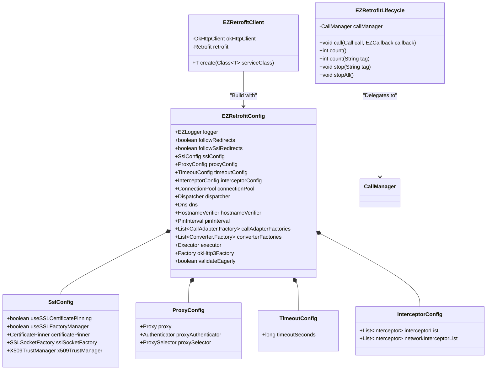

# Data Model & Domain Entities: Code Review Remediation

**Branch**: `spec/code-review-remediation` | **Date**: 2026-07-15

## Summary

本重構項目重新定義了設定模型與生命週期控制之領域實體 (Entities)。透過職責分離模式，將原有的配置與客戶端實體進行了高度內聚的劃分。

---

## 領域實體定義

---

## 實體屬性細節說明

### 1. 領域配置子物件 (Under `tw.idv.laiis.ezretrofit.config`)

* **`SslConfig`**
  * 職責：封裝安全通訊協定與憑證驗證設定。
  * 屬性：
    * `useSSLCertificatePinning` (boolean): 是否啟用憑證綁定。
    * `certificatePinner` (CertificatePinner): 憑證指紋比對物件。
    * `useSSLFactoryManager` (boolean): 是否啟用自訂 SSL Socket Factory。
    * `sslSocketFactory` (SSLSocketFactory): 自訂 SSL 安全通道工廠。
    * `x509TrustManager` (X509TrustManager): 自訂 X.509 憑證信賴管理器。
* **`ProxyConfig`**
  * 職責：封裝網路代理服務設定。
  * 屬性：
    * `proxy` (Proxy): 代理伺服器。
    * `proxyAuthenticator` (Authenticator): 代理伺服器驗證程序。
    * `proxySelector` (ProxySelector): 代理伺服器選擇器。
* **`TimeoutConfig`**
  * 職責：封裝連線與讀寫超時時間設定。
  * 屬性：
    * `timeoutSeconds` (long): 超時秒數。若 ≤ 0L 則表示不限制或使用預設值。
* **`InterceptorConfig`**
  * 職責：封裝 OkHttp 攔截器列表。
  * 屬性：
    * `interceptorList` (List): 應用程式級攔截器。
    * `networkInterceptorList` (List): 網路級攔截器。

---

### 2. 設定中心實體 (`EZRetrofitConfig`)

* **`EZRetrofitConfig`**
  * 職責：作為全局配置整合中心，管理除上述領域配置子物件外的其他設定（例如：`ConnectionPool`、`Dispatcher`、`Dns` 等），並提供 Fluent Builder 模式進行配置建置。
  * 可變性：不可變實體 (Immutable Object)。一旦透過 Builder 建置後，所有配置均不得動態修改，以確保執行緒安全性。

---

### 3. 客戶端與生命週期管理實體 (Under `tw.idv.laiis.ezretrofit.client`)

* **`EZRetrofitClient`**
  * 職責：負責根據 `EZRetrofitConfig` 規格，建立並配置 `OkHttpClient` 及 `Retrofit` 實例，進而動態生成業務 REST API 接口物件。
* **`EZRetrofitLifecycle`**
  * 職責：代理並追蹤非同步網路請求狀態。在進行 `call`、`stop`、`count` 等生命週期操作時，調用 `CallManager` 實例進行底層控制。
